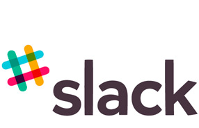
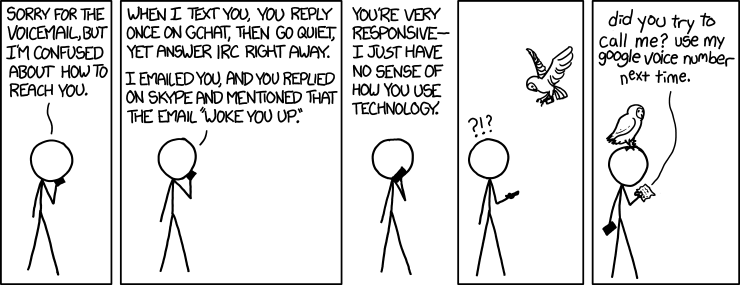

## What is Slack?

> 

> - [Slack](slack.com) is a team communication tool
  
> - Inspired by old-days IRC and modern social platforms

> - It is a more productive way to share knowlegment in a team than email

> - One of the most successful startups in 2014

--- .class #id 

## Email kills productivity

> - Everyone complains about email (you too!)
> - Email is not designed for collaboration or sharing  
>     + Really hard to follow conversations (The Re:Re:...:Re syndrome)
>     + Difficult to keep track of attachments
> - Too much time proccessing
> - Unpredictible (server-to-server)

---

## Reasons to use Slack

>   1. All Team Communication is One Place (but conveniently channeled!)
>   2. Integration with Services We Already Use (GDrive, Dropbox, Skype, ...)
>   3. All Content is Searchable from One Search Box
>   4. File Sharing (beyond Drive or Dropbox integration)
>   5. Code Snippets!!!
>   6. Private conversation (one-to-one or groups)
>   7. Accessible Anywhere (multiplatform)
>   8. It is clean, uncluttered and consistent

---

## Channels

> - Channels = chatrooms
> - Default channels: #general and #random 
> - Channels are open and transparent, users can create or join
> - Anyone in the team can check the archive for any channel 
> - Ideally, one channel per project/area in the team
> - Join relevant channels and set the notifications
> - Participants can see the entire thread of messages, even those that came before they joined
> - MAKE SURE THAT YOU ARE SENDING YOUR MESSAGE TO THE RIGHT CHANNEL

---

## Direct Messages and Private Groups

> - In a team there is space for some private communications
> - Direct messages are used for private conversations at any time with a team member 
> - Direct messages are searchable content for you and the person messaging
> - There is an agent called slackbot that can do some tasks (reminders) by DM

> - Private groups are chatrooms where only invited members can read/write/share/search

---

## Notifications

> - It is critical to choose the notification settings (desktop and mobile) that fit you
> - Configure the default notifications in your account/notification
> - Three levels:
    + Any activity
    + Only mentions and **highlight** words 
    + No notifications
> - Can override default notifications by setting specific notifications for each channel
> - CHOOSE YOUR NOTIFICATION SETTING WISELY

---

## Mentions

> - You can mention other users in a message to call their attention (notification)
> - @channel and @group will send a notification to all team members in the channel or group in which you post the message
> - @everyone notifies every member of your team, only in the team-wide channel 
> - DO NOT MENTION @everyone IN VAIN

---

## Integrations

> - Integration with different services is the 2nd more powerful feature of Slack
> - Google Drive or Dropbox: paste a link and then the file content is searchable
    + Use the link obtained from the "share" button, not the URL from address bar
    + If you use the Import from Dropbox feature, the file will be in Slack's storage
> - Skype: Select a person in the Team Directory and click in the "call to Skype"
> - IFTTT (If This Then This). Automatize the flux of content with several web services 
    + Tag items in Gmail, Pocket, Evernote, etc. and automatically posted in a Slack's channel
> - More possible and useful integrations: Asana, BitBucket, Hangouts, Github, RSS, Twitter, Zapier, ...

---

## Searching

> - Slack's most powerful feature
> - From the same box you can search everything in Slack
> - Once you integrate something with Slack, you can search through the files you've uploaded
> - Filters: by user, by time, by channel

---

## Limitations of Slack's free version 

> - Only 10,000 message searchable (most recent) archive. 
    + This limit could be reached soon 
    + Avoid superfluous messages
> - File storage limited to 5GB
    + Use preferently the Google Drive or Dropbox integrations.
> - Only 5 integrations could be configured

---

## More features

> - Team owners and admins can export their team's Slack data
   
> - There is no native desktop app for Windows or Linux
    + Can create an Application Shortcut in Google Chrome
    + No offline access at all !!! (SEVERE PITFALL)
> - You can edit your messages! (although this could be evil)
> - There is not a Team Calendar
    + Upcoming integration with Google Calendar

---

## More info

- [Slack](https://slack.com)
- [Slack is killing email | The Verge](http://www.theverge.com/2014/8/12/5991005/slack-is-killing-email-yes-really)
- [Streamline Your Team Communications With Slack](http://computers.tutsplus.com/tutorials/streamline-your-team-communications-with-slack--cms-21327)
- [Slack Sets New Standard for Team Communication Online](http://collaboration.about.com/od/groupcommunication/fl/Slack-Sets-New-Standard-for-Team-Communication-Online.htm)
- [Slack Makes Group Communication Faster and Easier](http://www.makeuseof.com/tag/slack-makes-group-communication-faster-easier/)
- [7 Reasons Why Slack Team Communication Strengthens Our Business](http://fooplugins.com/slack-team-communication-tool/)
- [SKYPE, HIPCHAT OR SLACK? OUR QUEST FOR A REMOTE COMMUNICATION TOOL](https://softwaremill.com/skype-hipchat-slack-quest/)

---

## It's all about reaching peers

[Strip by xkcd](http://xkcd.com/1254/)
  
  
  
  

